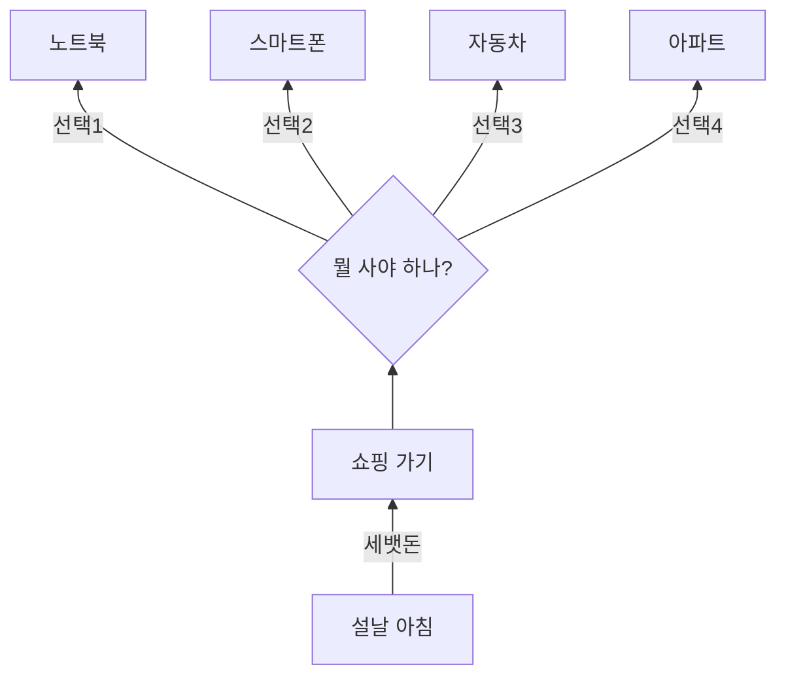
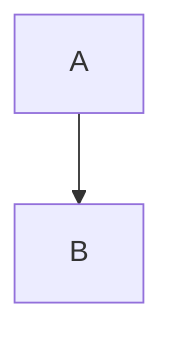

# Overview
Mermaid 튜토리얼 입니다.

Back-tick

```mermaid
flowchart BT
    A[설날 아침] --> |세뱃돈| B[쇼핑 가기]
    B --> C{뭘 사야 하나?}
    C -->|선택1| D[노트북]
    C -->|선택2| E[스마트폰]
    C -->|선택3| F[자동차] 
    C -->|선택4| G[아파트] 
```

문서작성을 계속하면 됩니다....

Diagram이 필요한 곳에 그때 그때 추가합니다.

```mermaid
flowchart
    A --> B
```

문서화를 계속합니다...
