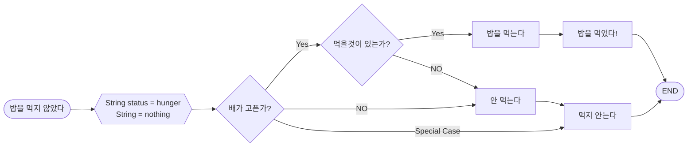

# Flowchart 튜토리얼

```mermaid
flowchart LR
    a([밥을 먹지 않았다])
    b{{String status = hunger <br> String = nothing }}
    c{배가 고픈가?}
    d{먹을것이 있는가?}
    e[밥을 먹는다]
    f[밥을 먹었다!]
    g([END])

    a --> b --> c -->|Yes| d -->|Yes| e --> f --> g

    h[안 먹는다]

    c -->|NO| h
    d -->|NO| h

    i[먹지 안는다]

    h --> i
    i --> g
    c -->|Special Case| i

```
