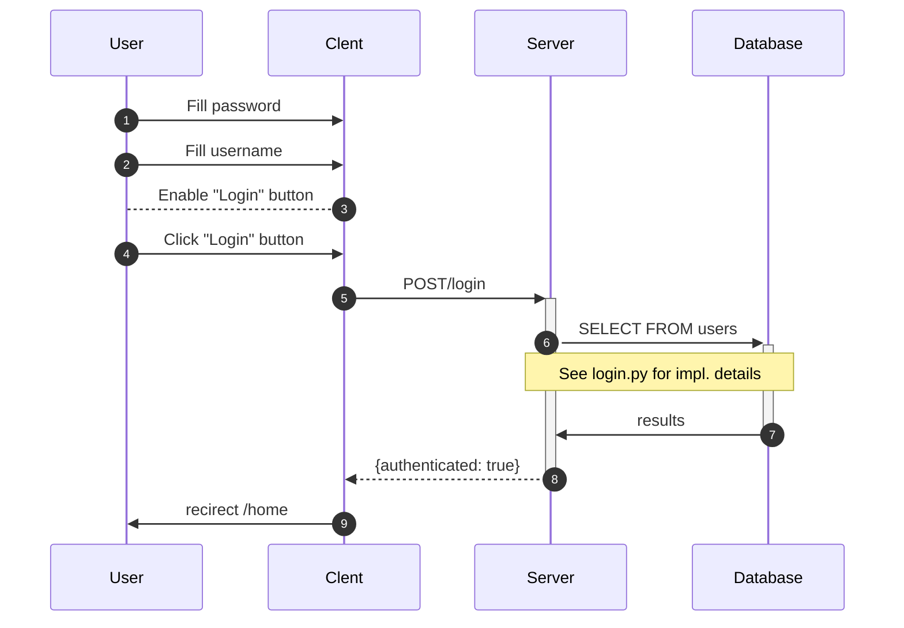

# Sequence Diagram Tutorial

```mermaid
sequenceDiagram
    participant U as User
    participant C as Clent
    participant S as Server
    participant DB as Database

    autonumber
    
    U ->> C: Fill password
    U ->> C: Fill username
    C --> U: Enable "Login" button
    U ->> C: Click "Login" button

    C ->>+ S: POST/login
        S ->>+ DB: SELECT FROM users
            Note over S, DB : See login.py for impl. details
        DB ->>- S: results
    S -->>- C: {authenticated: true}

    C ->> U: recirect /home
```