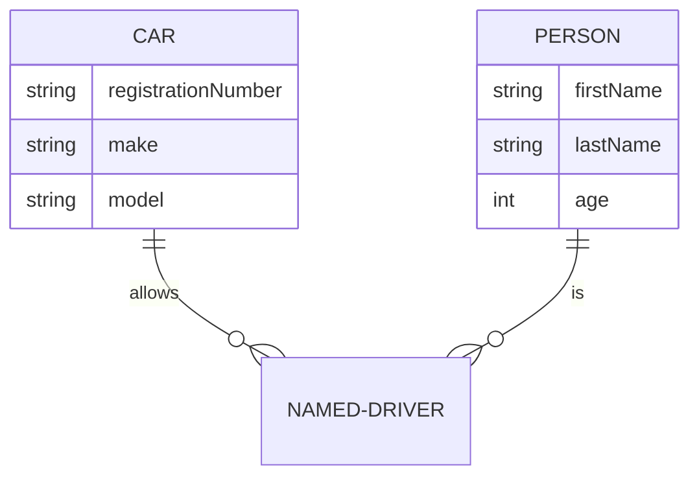
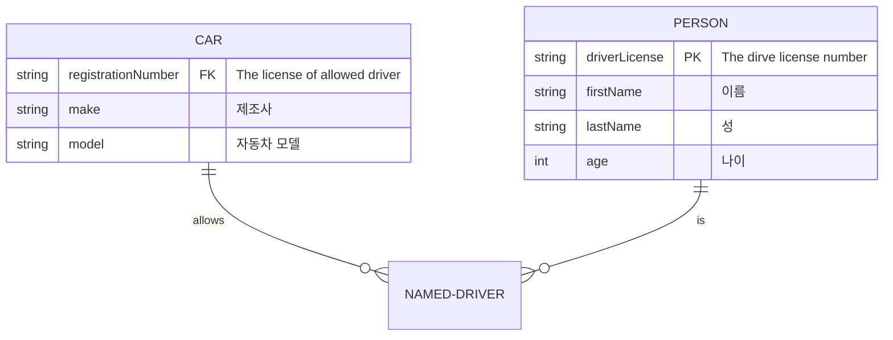

## ER Diagram Tutorial

```mermaid
erDiagram
    CAR  ||--o{ NAMED-DRIVER : allows
    PERSON ||--o{ NAMED-DRIVER : is

    CAR{
        string registrationNumber
        string make
        string model
    }

    PERSON{
        string firstName
        string lastName
        int age
    }
```

```mermaid
erDiagram
    CAR  ||--o{ NAMED-DRIVER : allows
    PERSON ||--o{ NAMED-DRIVER : is

    CAR{
        string registrationNumber FK "The license of allowed driver"
        string make "제조사"
        string model "자동차 모델"
    }

    PERSON{
        string driverLicense PK "The dirve license number"
        string firstName "이름"
        string lastName "성"
        int age "나이"
    }
```